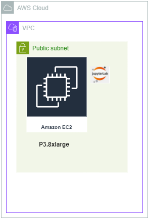

# LLM Inferencing Tutorial on Amazon EC2 P3.8xlarge Instance using Mistral 7B parameter Model

## Overview
In this tutorial, we will:

1. Create a GPU instance in AWS – p3.8xl instance that contains four NVIDIA Tesla V100 GPUs

2. Install compatible version of CUDA toolkit and ensure that the toolkit is installed and visible and ready to go

3. Install compatible version of Pytorch that is compatible with the CUDA toolkit version

5. Run inference on the GPU instance using the Mistral 7B model and the provided Jupyter notebook


## Architecture
Our architecture consists of a P3.8xlarge  EC2 instance. The VM is within a public subnet of our VPC in an AWS region. The ports 22 is open to allow SSH connection. Port 8888 is open for the connecting to the jupyter notebook.

We will install Jupyterlab in the EC2 instance and run the demo using the provided notebook.




## Pre-requisites
- Access to an AWS account and privilege to setup EC2 instances
- Knowledge of setting up EC2 instances
- Basic familiarity with running CLI commands, SSH, and running Jupyter notebook

## Setup Steps
Please follow the steps in sequence

### Step-01
Launch an EC2 instance from AWS Console. Select US-East-1 region, since it is likely to have better availability in that region. Specs for the EC2 instance as follows.

> P3.8xlarge
>
> Ubuntu 20.04
>
> 250 GB disk storage
>
> Enable public IP
>
> Inside your existing VPC or default VPC
>
> Create a key pair or use your existing key pair
>
> Create a security group or use your existing security group. Inbound rules needed for security group are:
>> open port 22 for SSH from your desired IP address
>>
>> open port 8888 for connecting to jupyter notebook from your desired IP address
>
> Wait until the EC2 instance is fully launched and ready

### Step-02
Log into the EC2 instance via SSH. You will need the EC2 key pair that you created or reused in the earlier step. Since the OS is ubuntu 20.04, your ssh login username will be ubuntu.

You can use your favorite SSH clients like putty or bitvise or even log in from your command line.

Once logged in you will be at the directory `/home/ubuntu`

### Step-03
Run the following commands.

Update the OS

`sudo apt-get update`

`sudo apt-get upgrade -y`

### Step-04
Ubuntu 20.04 comes with Python 3.8. For some of the libraries and dependencies we will use later, we need Python 3.10. The instructions in this step will install Python 3.10

`sudo apt update`

`sudo apt-get install software-properties-common`

`sudo apt update`

`add-apt-repository --help`

`sudo add-apt-repository ppa:deadsnakes/ppa`
*Press Enter when prompted*

`sudo apt-get update`

`apt list | grep python3.10`

`sudo apt-get install python3.10 -y`

`sudo update-alternatives --install /usr/bin/python3 python3 /usr/bin/python3.8 1`

`sudo update-alternatives --install /usr/bin/python3 python3 /usr/bin/python3.10 2`

`sudo update-alternatives --config python3`

Choose the selection for python3.10 manual mode and press enter. It should look like below.

```
Selection    Path                 Priority   Status
------------------------------------------------------------
* 0            /usr/bin/python3.10   2         auto mode
  1            /usr/bin/python3.10   2         manual mode
  2            /usr/bin/python3.8    1         manual mode

Press <enter> to keep the current choice[*], or type selection number:
```

`python3 -V`

It will show python 3.10 version like below

```
ubuntu@ip-172-31-27-187:~$ python3 -V
Python 3.10.14
```

### Step-05
In this step, we will install CUDA toolkit. The CUDA compatibility guide is published here - https://docs.nvidia.com/deploy/cuda-compatibility/index.html. The Pytorch version compatibility guide is published here - https://pytorch.org/. At the time of writing this tutorial, the latest stable version of Pytorch is 2.2.2. This is the version we will use. For Pytorch 2.2.2 along with Linux OS, Pip distribution channel, programming language Python, the version of CUDA that are compatible are 11.8 and 12.1. In our demo we will use CUDA version 11.8. Run the below instructions from the ```/home/ubuntu``` folder to install CUDA 11.8. The instructions for installing CUDA Toolkit 11.8 is found here - https://developer.nvidia.com/cuda-11-8-0-download-archive. We will be doing the deb (local) installer type.

`wget https://developer.download.nvidia.com/compute/cuda/repos/ubuntu2004/x86_64/cuda-ubuntu2004.pin`

`sudo mv cuda-ubuntu2004.pin /etc/apt/preferences.d/cuda-repository-pin-600`

`wget https://developer.download.nvidia.com/compute/cuda/11.8.0/local_installers/cuda-repo-ubuntu2004-11-8-local_11.8.0-520.61.05-1_amd64.deb`

`sudo dpkg -i cuda-repo-ubuntu2004-11-8-local_11.8.0-520.61.05-1_amd64.deb`

`sudo cp /var/cuda-repo-ubuntu2004-11-8-local/cuda-*-keyring.gpg /usr/share/keyrings/`

`sudo apt-get update`

`sudo apt-get -y install cuda` *This step takes a few minutes, please be patient*

> For the changes to take effect, we need to reboot the machine. The command below reboots the machine. Wait a couple of minutes after it is rebooted, connect back via ssh. Once you connect back, make sure to be in the ```/home/ubuntu``` folder

`sudo reboot`

> After connecting back via SSH, we need to check if the CUDA Toolkit and the NVIDIA drivers got installed correctly. Run the below command

`nvidia-smi` *The output should look like below*

```
Sat Apr 20 05:49:55 2024
+-----------------------------------------------------------------------------+
| NVIDIA-SMI 520.61.05    Driver Version: 520.61.05    CUDA Version: 11.8     |
|-------------------------------+----------------------+----------------------+
| GPU  Name        Persistence-M| Bus-Id        Disp.A | Volatile Uncorr. ECC |
| Fan  Temp  Perf  Pwr:Usage/Cap|         Memory-Usage | GPU-Util  Compute M. |
|                               |                      |               MIG M. |
|===============================+======================+======================|
|   0  Tesla V100-SXM2...  On   | 00000000:00:1B.0 Off |                    0 |
| N/A   43C    P0    54W / 300W |   4282MiB / 16384MiB |      0%      Default |
|                               |                      |                  N/A |
+-------------------------------+----------------------+----------------------+
|   1  Tesla V100-SXM2...  On   | 00000000:00:1C.0 Off |                    0 |
| N/A   49C    P0    53W / 300W |   4914MiB / 16384MiB |      0%      Default |
|                               |                      |                  N/A |
+-------------------------------+----------------------+----------------------+
|   2  Tesla V100-SXM2...  On   | 00000000:00:1D.0 Off |                    0 |
| N/A   47C    P0    55W / 300W |   4914MiB / 16384MiB |      0%      Default |
|                               |                      |                  N/A |
+-------------------------------+----------------------+----------------------+
|   3  Tesla V100-SXM2...  On   | 00000000:00:1E.0 Off |                    0 |
| N/A   46C    P0    61W / 300W |   4280MiB / 16384MiB |      0%      Default |
|                               |                      |                  N/A |
+-------------------------------+----------------------+----------------------+

+-----------------------------------------------------------------------------+
| Processes:                                                                  |
|  GPU   GI   CI        PID   Type   Process name                  GPU Memory |
|        ID   ID                                                   Usage      |
|=============================================================================|
|    0   N/A  N/A      1191      G   /usr/lib/xorg/Xorg                  4MiB |
|    0   N/A  N/A      3001      C   ...a_tutorial/bin/python3.10     4274MiB |
|    1   N/A  N/A      1191      G   /usr/lib/xorg/Xorg                  4MiB |
|    1   N/A  N/A      3001      C   ...a_tutorial/bin/python3.10     4906MiB |
|    2   N/A  N/A      1191      G   /usr/lib/xorg/Xorg                  4MiB |
|    2   N/A  N/A      3001      C   ...a_tutorial/bin/python3.10     4906MiB |
|    3   N/A  N/A      1191      G   /usr/lib/xorg/Xorg                  4MiB |
|    3   N/A  N/A      3001      C   ...a_tutorial/bin/python3.10     4272MiB |
+-----------------------------------------------------------------------------+
```

> Next, add the CUDA path in the PATH environment variable

`sudo nano /home/$USER/.bashrc`

Inside there add the following: 

```
export PATH="/usr/local/cuda-11.8/bin:$PATH"
export LD_LIBRARY_PATH="/usr/local/cuda-11.8/lib64:$LD_LIBRARY_PATH"
```

Then do the following to save and close the editor:

```
On you keyboard press the following: 

 ctrl + o             --> save 
 enter or return key  --> accept changes
 ctrl + x             --> close editor
```

`source .bashrc`

`nvcc --version`


### Step-06
In this step, we will create a python virtual environment, we will call it ```cuda_tutorial```. In this virtual environment, we will install Pytorch and Jupyterlab. This virtual environment will be used in later steps for running all the code within Jupyter notebooks with Pytorch and Huggingface transformers.


Install pip

`sudo apt-get install python3-pip`

`sudo apt-get install python3.10-venv`

`python3.10 -m venv cuda_tutorial`

`source cuda_tutorial/bin/activate`

`pip3 install torch torchvision torchaudio --index-url https://download.pytorch.org/whl/cu118` *This command comes from ```pytorch.org``` based on selection of Pytorch version 2.2.2, Linux, PIP, Python and CUDA 11.8*


> Next we will install and configure Jupyterlab

`pip3 install jupyterlab jupyter`

Generate Jupyter notebook configuration file

`jupyter notebook --generate-config`

> note the path to the configuration file is /home/ubuntu/.jupyter/jupyter_notebook_config.py

Create Jupyter notebook password

`jupyter notebook password`
>
> you enter the password of your choice. You will need to re-enter the password to confirm


## Run Jupyter Notebook to do inference on the Mistral 7B parameter model using GPU
> Navigate back to the ```/home/ubuntu``` folder

`cd /home/ubuntu`
> Activate the ```cuda_tutorial``` virtual environment we created earlier

`source cuda_tutorial/bin/activate`

> Start the Jupyterlab

`jupyter-lab --ip 0.0.0.0 --no-browser --allow-root`

Do not press control + C, keep this running, so that you can access the Jupyter notebook from your web browser.

Access the Jupyter notebook provided in the repository and run the instructions within the notebook provided to inference using the Mistral 7B model.


We will test one notebook in this step. The notebook is called ```Mistral-7B-v0.1_GPU_EC2_p3.8xl.ipynb```.

Open your favorite browser, like Chrome or something you use. On the address bar line type the following link and press `Enter` key.
`http://Public_IP:8888`, where **Public_IP** is the public IP address of your EC2 instance. You can get the public IP address from the AWS console or CLI

Once the Jupyter notebook opens, give the password you set befor. This will bring you into the Jupyter notebook environment.

Open the notebook ```Mistral-7B-v0.1_GPU_EC2_p3.8xl.ipynb``` and run the code within each cell of the notebook. The notebook contains documentation and instruction explaining the steps.


## Run Jupyter Notebook to demonstrate how to download a model from Huggingface transformers and run inference with the model using GPU

We will test one notebook in this step. The notebook is called ```Mistral-7B-v0.1_GPU_EC2_p3.8xl.ipynb``` and is included inside the repository.

Once the notebook ```Mistral-7B-v0.1_GPU_EC2_p3.8xl.ipynb``` is launched, run the code within each cell of the notebook. The notebook contains documentation and instruction explaining the steps.

## Destroy AWS Resources to avoid unnecessary billing
Once you are done with the tutorial, please remember to delete or terminate the EC2 resource to avoid paying for that resource

